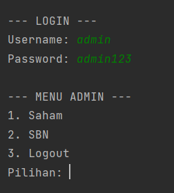
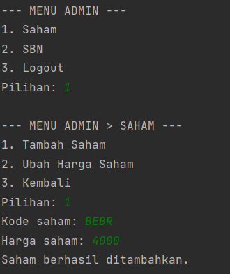
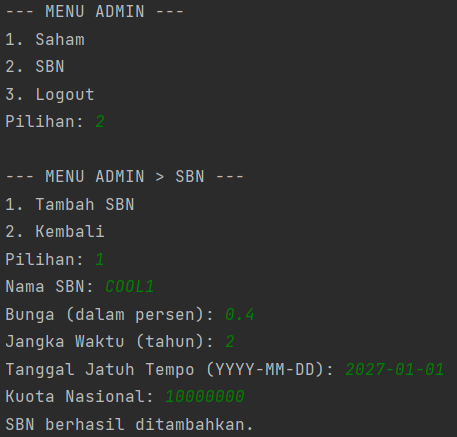
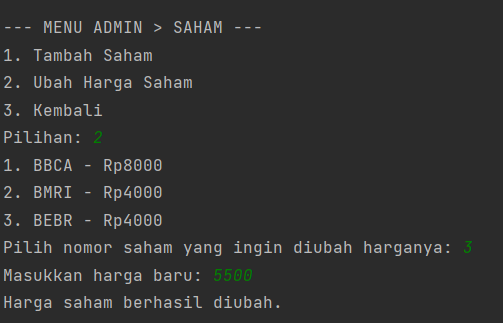
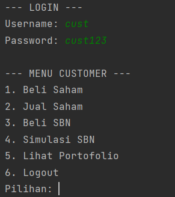
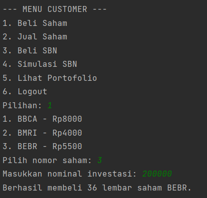
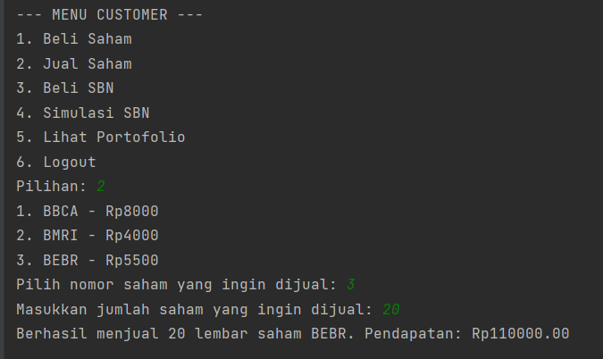
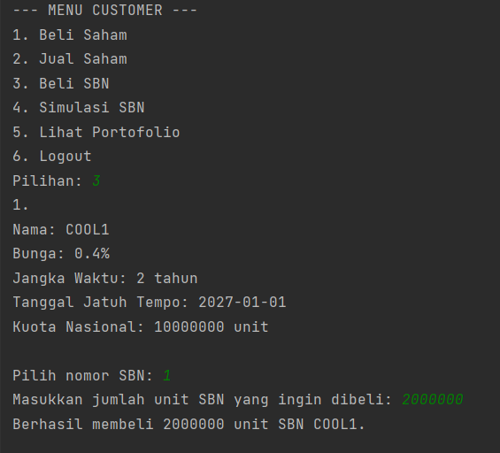
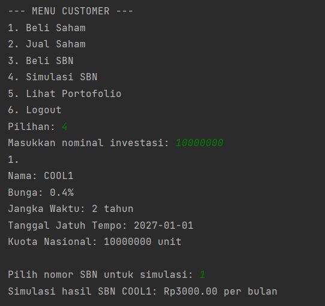
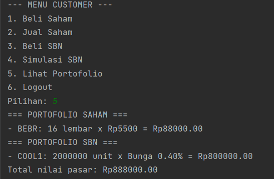

# Sistem Manajemen Investasi Saham dan SBN

Program ini adalah sistem simulasi sederhana berbasis Java untuk mengelola investasi **Saham** dan **SBN (Surat Berharga Negara)**. Ada dua jenis pengguna dalam sistem ini: **Admin** dan **Customer**.

---

## Daftar Isi
- [Studi Kasus dan Skenario](#studi-kasus-dan-skenario)
  - [1. Login sebagai Admin](#1-login-sebagai-admin)
  - [2. Admin Menambah Saham dan SBN](#2-admin-menambah-saham-dan-sbn)
  - [3. Admin Mengubah Harga Saham](#3-admin-mengubah-harga-saham)
  - [4. Login sebagai Customer](#4-login-sebagai-customer)
  - [5. Customer Membeli Saham](#5-customer-membeli-saham)
  - [6. Customer Menjual Saham](#6-customer-menjual-saham)
  - [7. Customer Membeli SBN](#7-customer-membeli-sbn)
  - [8. Customer Simulasi SBN](#8-customer-simulasi-sbn)
  - [9. Customer Melihat Portofolio](#9-customer-melihat-portofolio)
- [Struktur Program](#struktur-program)
- [Penutup](#penutup)

---

## Studi Kasus dan Skenario

### 1. Login sebagai Admin

**Penjelasan:**  
Admin login menggunakan username `admin` dan password `admin123` untuk mengakses menu Admin.

**Screenshot:**

---

### 2. Admin Menambah Saham dan SBN

**Penjelasan:**  
Admin dapat menambahkan saham baru dengan memasukkan kode saham dan harga awal. Untuk SBN, admin memasukkan nama, tingkat bunga, jangka waktu, tanggal jatuh tempo, dan kuota nasional.

**Screenshot Saham:**

**Screenshot SBN:**

---

### 3. Admin Mengubah Harga Saham

**Penjelasan:**  
Admin memilih saham yang ada lalu memperbarui harga saham tersebut.

**Screenshot:**

---

### 4. Login sebagai Customer

**Penjelasan:**  
Customer login menggunakan username `cust` dan password `cust123` untuk mengakses menu investasi.

**Screenshot:**

---

### 5. Customer Membeli Saham

**Penjelasan:**  
Customer memilih saham berdasarkan daftar yang tersedia dan memasukkan nominal uang untuk membeli saham tersebut.

**Screenshot:**

---

### 6. Customer Menjual Saham

**Penjelasan:**  
Customer memilih saham yang sudah dimiliki dan memasukkan jumlah lembar saham yang ingin dijual.

**Screenshot:**

---

### 7. Customer Membeli SBN

**Penjelasan:**  
Customer memilih SBN berdasarkan daftar yang tersedia dan memasukkan jumlah unit yang ingin dibeli.

**Screenshot:**

---

### 8. Customer Simulasi SBN

**Penjelasan:**  
Customer dapat mensimulasikan investasi SBN untuk melihat potensi keuntungan berdasarkan jumlah unit dan waktu tertentu.

**Screenshot:**

---

### 9. Customer Melihat Portofolio

**Penjelasan:**  
Customer dapat melihat seluruh saham dan SBN yang dimiliki beserta nilai totalnya.

**Screenshot:**

---

## Struktur Program

- **Login Sistem**: Autentikasi berbasis username/password.
- **Admin Menu**:
  - Tambah Saham
  - Tambah SBN
  - Ubah Harga Saham
- **Customer Menu**:
  - Lihat Saham/SBN
  - Beli/Jual Saham
  - Simulasi SBN
  - Lihat Portofolio
- **OOP Design**:
  - Class: `Stock`, `SBN`, `InvestmentList`, `CustomerInvestment`.

---

## Penutup

Program ini dibuat untuk mensimulasikan pengelolaan investasi Saham dan SBN dengan pendekatan berbasis **Object-Oriented Programming** (OOP) menggunakan Java.  
README ini menyediakan dokumentasi langkah-langkah skenario penggunaan lengkap dengan screenshot untuk memperjelas proses.

---

